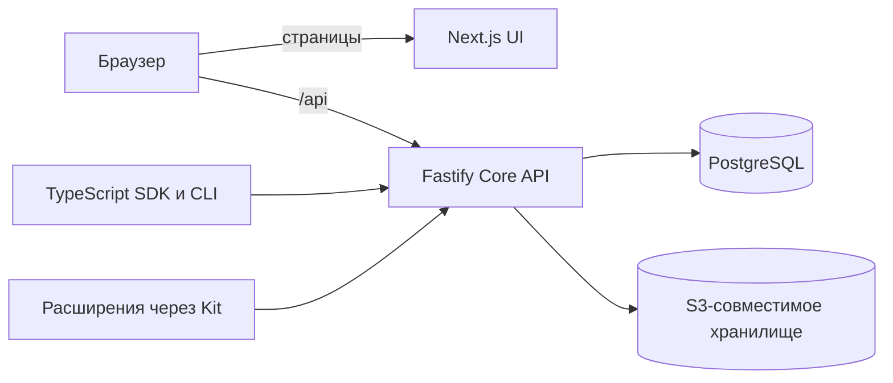

# Asmblyr Collaborative

**Данные команды, права доступа и расширения — на PostgreSQL.**

Asmblyr Collaborative — открытая платформа для команд, которым нужны настраиваемые
коллекции, редактор записей и HTTP API. Разработчики могут добавить серверные
обработчики и страницы через `@asmblyr-collaborative/kit`; интеграции работают
через API, TypeScript SDK и CLI.

**Статус: ранняя бета.** Одна установка предназначена для одной команды.
Интерфейс и основная документация сейчас на русском. SDK, CLI, Kit и контракты
доступны в npm как `0.1.0-beta.1` под тегом `beta`; выпуск не объявлен стабильным.

[Сайт и демо](https://asmblyr.io/) · [Рабочая консоль](https://console.asmblyr.io/) ·
[Быстрый старт](#быстрый-старт) · [Документация](docs/index.md) ·
[Участие](CONTRIBUTING.md)

## Что уже работает

| Область            | Возможности                                                                                                                      |
| ------------------ | -------------------------------------------------------------------------------------------------------------------------------- |
| Данные             | Коллекции, типизированные поля, связи M:1 / 1:M / M:N, формы, таблицы, поиск, вложенные фильтры и сохранённые виды               |
| Совместная работа  | Комментарии, живое присутствие, обновление записей, блокировки полей и проверка конфликтов при сохранении                        |
| Доступ             | Политики для действий, полей и строк; отдельные права на настройки; приглашения, пароль, passkey и SSO                           |
| Файлы и интеграции | S3-совместимое хранилище, сервисные аккаунты, GitLab CI federation, OAuth/OIDC provider и личные подключения Google Drive/Sheets |
| Разработка         | H3-обработчики, страницы, редакторы полей, коллекции и миграции через Kit; типизированный SDK и CLI `asm connect`                |
| Ассистент          | Опциональный потоковый чат, инструменты с правами пользователя и действия расширений через внутренний MCP                        |

Подробности и границы — в [карте возможностей](docs/guide/features.md).
Workspaces группируют коллекции, но не изолируют компании; публичного MCP endpoint
и установки расширений из интерфейса пока нет.

## Collaborative Live

Откройте одну запись в двух браузерах: участники видят друг друга, активное
редактирование поля и сохранённые изменения почти сразу. Таблица обновляется
через SSE; занятые поля показывают имя редактора. Если два человека изменили
одно поле, сохранение черновика возвращает конфликт и предлагает выбрать
значение. [Контракт и ограничения](docs/features/realtime.md).

## Ассистент и расширения

При настройке OpenAI-совместимого провайдера ассистент работает с разрешёнными
данными и явно опубликованными действиями расширений. `defineModelContext`
публикует H3-обработчик для ассистента и внутреннего MCP; обычный HTTP-обработчик
не становится инструментом автоматически. Доступ к данным дополнительно зависит
от прав вызывающего и настройки публикации коллекции в MCP. Личные подключения
Google Drive и Sheets поддерживают чтение по запросу и изменение после
подтверждения пользователя.

[Как работает ассистент](docs/development/assistant-architecture.md) ·
[Первое расширение](docs/development/first-extension.md) ·
[Контракт Kit](docs/reference/kit-guide.md)

## Быстрый старт

Нужны **Node.js 22+, pnpm 11.13.1 и Docker Compose**. Из корня репозитория:

```sh
pnpm install --frozen-lockfile
pnpm db:up
cp -n apps/core/.env.example apps/core/.env
```

В `apps/core/.env` задайте случайный `ASMBLYR_SETUP_TOKEN` длиной не менее 32
символов. Затем:

```sh
pnpm db:migrate
pnpm dev
```

Откройте [localhost:3000/setup](http://localhost:3000/setup), чтобы создать первого
администратора. Копируйте шаблон `.env` только если файла ещё нет. Подробнее —
[первый запуск](docs/guide/getting-started.md).
Для Docker и Kubernetes предусмотрены отдельные образы Core и UI, собранные из
одного коммита, Docker Compose и Helm-чарт. PostgreSQL и S3 подключаются отдельно:
[установка и настройка](deploy/README.md). CI публикует согласованную пару
`ghcr.io/asmblyr/collaborative-core` и `ghcr.io/asmblyr/collaborative-ui`;
для установки закрепляйте оба образа одной версии по digest.
SDK, CLI, Kit и общие контракты доступны в npm как `0.1.0-beta.1` под тегом
`beta`: [установка и подключение](docs/reference/packages.md). Docker-сборка
не зависит от предварительной публикации этих пакетов.

## Развёртывание

Основной способ установки использует отдельные образы Core и UI. Совместимый
монолитный образ доступен для существующих установок. [Docker и обновления](docs/guide/deployment.md)
описывают сборку из исходников, Compose и эксплуатационные границы.
[Опубликованные пакеты](docs/reference/packages.md) и
[CLI](docs/reference/cli-guide.md) предназначены для внешних клиентов.

## Как устроен проект



Core отвечает за HTTP, авторизацию и данные; UI предоставляет админку.
Браузерная сессия обрабатывается Core. Серверный код расширений исполняется внутри Core как доверенный
код. [Архитектура](docs/development/architecture.md) и
[структура репозитория](docs/development/local-development.md) раскрывают границы
компонентов и хранения.

## Документация и участие

- [Руководства и справочники](docs/index.md) · [HTTP API](docs/reference/http.md) · [TypeScript SDK](docs/reference/sdk-guide.md)
- [Локальная разработка](docs/development/local-development.md) · [Участие в проекте](CONTRIBUTING.md)
- [Безопасность и сообщение об уязвимости](SECURITY.md)

## Лицензия

[MIT](LICENSE). Сторонние зависимости сохраняют свои лицензии. Дополнительное
локальное S3-хранилище использует MinIO под AGPL. Встроенный шрифт Geist
распространяется по [SIL OFL 1.1](apps/ui/src/app/fonts/OFL.txt).
