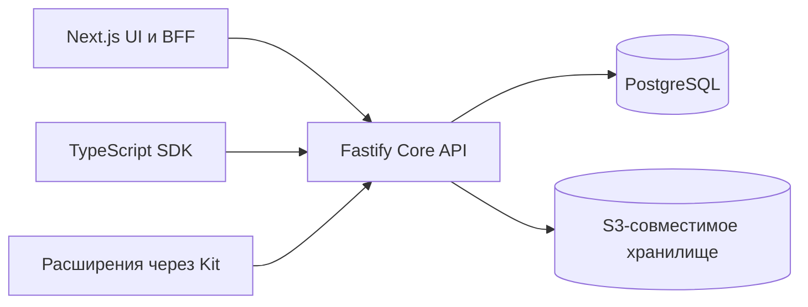

# Asmblyr Collaborative

**Данные команды, права доступа и расширения — в собственной установке на PostgreSQL.**

Asmblyr Collaborative — открытая платформа для команд, которым нужны настраиваемые
коллекции, редактор записей и HTTP API без разработки отдельной админки с нуля.
Разработчики могут добавить серверные обработчики и страницы через `@asmblyr/kit`;
интеграции работают через API и TypeScript SDK.

**Статус: ранняя бета.** Одна установка предназначена для одной команды.
Интерфейс и основная документация сейчас на русском. Пакеты Kit и SDK пока
используются внутри workspace; опубликованных npm-пакетов и готовых release-образов нет.

[Быстрый старт](#быстрый-старт) · [Документация](docs/index.md) ·
[Возможности и ограничения](docs/guide/features.md) · [Участие](CONTRIBUTING.md)

**Посмотреть продукт:** [сайт и демо](https://asmblyr.io/) ·
[рабочая консоль](https://console.asmblyr.io/).

## Что уже работает

| Область            | Возможности                                                                                                        |
| ------------------ | ------------------------------------------------------------------------------------------------------------------ |
| Данные             | Коллекции, типизированные поля, связи M:1 / 1:M / M:N, формы, таблицы, поиск, вложенные фильтры и сохранённые виды |
| Совместная работа  | Комментарии к записям, присутствие на странице и проверка конфликта изменённых полей при сохранении черновика      |
| Доступ             | Политики для действий, полей и строк; отдельные права на настройки; приглашения, пароль, passkey и SSO             |
| Файлы и интеграции | Приватное S3-совместимое хранилище, сервисные аккаунты, GitLab CI federation и OAuth/OIDC provider                 |
| Расширения         | H3-обработчики, страницы, редакторы полей, собственные коллекции, миграции и настройки через Kit                   |
| Ассистент          | Опциональный потоковый чат с инструментами, работающими в рамках прав пользователя                                 |

Подробности и известные ограничения — в [карте возможностей](docs/guide/features.md).
В частности, workspaces группируют коллекции, но не изолируют компании; публичного
MCP endpoint и установки расширений из интерфейса пока нет.

## Ассистент и расширения

При настройке OpenAI-совместимого провайдера ассистент может искать и читать
доступные пользователю данные, готовить фильтры и вызывать явно опубликованные
действия расширений. Внутренний MCP объединяет эти инструменты. `defineModelContext`
публикует H3-обработчик для ассистента и внутреннего MCP; обычный HTTP-обработчик
не становится инструментом автоматически. Доступ к данным дополнительно зависит
от прав вызывающего и настройки публикации коллекции в MCP.

[Как работает ассистент](docs/development/assistant-architecture.md) ·
[Первое расширение](docs/development/first-extension.md) ·
[Контракт Kit](docs/reference/kit-guide.md)

## Быстрый старт

Нужны **Node.js 22+, pnpm 11.13.1 и Docker Compose**. Из корня репозитория:

```sh
pnpm install --frozen-lockfile
pnpm db:up
cp -n apps/core/.env.example apps/core/.env
```

В `apps/core/.env` задайте случайный `ASMBLYR_SETUP_TOKEN` длиной не менее 32
символов. Затем:

```sh
pnpm db:migrate
pnpm dev
```

Откройте `http://localhost:3000/setup` и создайте первого администратора
локальной установки.
Копируйте шаблон `.env` только если файла ещё нет. Полная инструкция для локального
запуска, Docker и обновления — в [руководстве по установке](docs/guide/getting-started.md)
и [развёртыванию](docs/guide/deployment.md).

## Как устроен проект



Core отвечает за HTTP, авторизацию и данные; UI предоставляет админку и серверный
прокси для сессии. Серверный код расширений исполняется внутри Core как доверенный
код. [Архитектура и схема вызовов](docs/development/architecture.md) объясняют
границы компонентов и хранения.

## Документация и участие

- [Начало, функции, разработка и справочники](docs/index.md)
- [HTTP API и полнота OpenAPI](docs/reference/http.md) · [TypeScript SDK](docs/reference/sdk-guide.md)
- [Локальная разработка и проверки](docs/development/local-development.md) · [Участие в проекте](CONTRIBUTING.md)
- [Безопасность и сообщение об уязвимости](SECURITY.md)

## Лицензия

[MIT](LICENSE). Сторонние зависимости сохраняют свои лицензии. Дополнительное
локальное S3-хранилище использует MinIO под AGPL.
