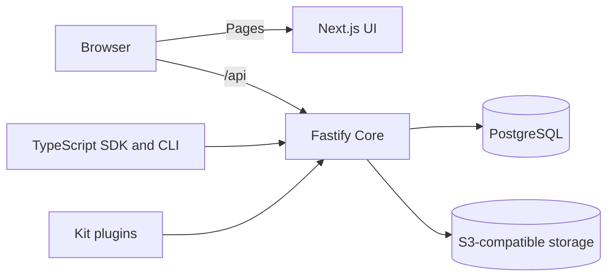

<!-- languages -->

[English](README.md) · [Русский](README.ru.md)

<!-- /languages -->

<p align="center">
  <picture>
    <source media="(prefers-color-scheme: dark)" srcset="docs/assets/brand/collaborative-logo-dark.svg">
    
  </picture>
</p>

<p align="center">
  <strong>A collaborative workspace for your PostgreSQL data.</strong><br>
  Collections, an admin interface, access policies, and an API — on your infrastructure.
</p>

<p align="center">
  <a href="https://github.com/Asmblyr/Collaborative/actions/workflows/verify.yml"></a>
  <a href="LICENSE"></a>
  <a href="https://github.com/Asmblyr/Collaborative/releases"></a>
</p>

<p align="center">
  <a href="#quick-start">Quick start</a> ·
  <a href="deploy/README.md">Deployment</a> ·
  <a href="docs/index.md">Documentation</a> ·
  <a href="CONTRIBUTING.md">Contributing</a>
</p>

Collaborative turns PostgreSQL data into a workspace your team can use together.
Define collections and relationships, build forms and table views, and control
which records and fields each person can access. Use the same data through the
HTTP API or a typed TypeScript client, and extend the product with plugins.

**Early beta.** Each installation is intended for one team. The interface supports
English and Russian, as does the documentation (English by default). SDK and CLI
packages are available under the npm `beta` tag.

## What you can do

| Area                   | Capabilities                                                                                                                                        |
| ---------------------- | --------------------------------------------------------------------------------------------------------------------------------------------------- |
| **Model your data**    | Typed fields, M:1 / 1:M / M:N relationships, custom fields on supported system collections, and read-only materialized views.                       |
| **Build a workspace**  | Configurable forms and tables, relevance search, nested filters, saved views, tags, and translated collection and field labels.                     |
| **Work together**      | Discussions, notifications, live presence, saved-record updates, advisory field locks, and conflict handling that preserves local edits.            |
| **Control access**     | Policies for actions, fields, and rows; invitations by link; passwords, passkeys, and external SSO; service accounts and OAuth/OIDC applications.   |
| **Connect services**   | S3-compatible storage, encrypted connection secrets, optional Yandex KMS, personal Google Drive/Sheets connections, and optional Sentry monitoring. |
| **Extend the product** | Server handlers, UI pages, field editors, collections, and migrations through the plugin Kit; a TypeScript SDK and schema-generating CLI.           |
| **Use an assistant**   | Optional streaming chat with conversation history, permission-aware data tools, and explicitly exposed plugin actions.                              |

See the [feature guide](docs/guide/features.md) for details and current limits.
Workspaces organize collections within an installation; they are not tenant
isolation boundaries. Plugins are installed with the application, and their
server code runs as trusted code inside Core.

## Live collaboration

Open the same record in two sessions to see who is there, which fields are being
edited, and changes after they are saved. Tables and record editors receive
updates over server-sent events. Unsaved edits stay in the form; conflicting
changes to the same field can be reviewed before saving.

Field locks help coordinate editing. Conflict checks protect draft saves;
ordinary API writes retain their documented behavior. Live events come from
operations through Core, not direct SQL writes.
[How live collaboration works](docs/features/realtime.md).

## Quick start

For local development, install **Node.js 22+, pnpm 11.13.1, and Docker Compose**.

```sh
git clone https://github.com/Asmblyr/Collaborative.git
cd Collaborative
pnpm install --frozen-lockfile
pnpm db:up
cp -n apps/core/.env.example apps/core/.env
```

Set `ASMBLYR_SETUP_TOKEN` in `apps/core/.env` to a random value of at least
32 characters, then start the application:

```sh
pnpm db:migrate
pnpm dev
```

Open [localhost:3000/setup](http://localhost:3000/setup) to create the first
administrator. The copy command above is for a POSIX shell; on Windows, copy the
example file without overwriting an existing `.env`.
See [first-time setup](docs/guide/getting-started.md) for configuration details.

## Deploy with Docker or Kubernetes

Deploy **Core and UI as a matching pair**, built from the same commit. PostgreSQL
and S3-compatible storage are connected separately. Both components can share
one public origin, with the API available at `/api`.

- **Docker Compose:** [deployment instructions](deploy/README.md#docker-compose).
- **Kubernetes:** [Helm chart](deploy/helm/collaborative) and [configuration](deploy/README.md#kubernetes-and-helm).
- **Images:** `ghcr.io/asmblyr/collaborative-core` and `ghcr.io/asmblyr/collaborative-ui`.
- **Operations:** [upgrades](docs/guide/deployment.md), [backups and recovery](docs/development/operations.md).

Pin both images to the same release and their respective digests. Container builds
compile the SDK, Kit, contracts, and bundled plugins directly from this repository;
they do not require those packages to be published to npm first.

## Connect a TypeScript project

```sh
npm install @asmblyr-collaborative/sdk@beta
npm install --save-dev @asmblyr-collaborative/cli@beta
npx asm connect --url http://localhost:3000
```

The CLI opens your installation's sign-in and consent flow, downloads the schema
available to your account, and generates collection and plugin types. No custom
compiler or bundler plugin is required. Schema authorization does not grant data
access; API requests still need their own authenticated session or credentials.

[SDK guide](docs/reference/sdk-guide.md) ·
[CLI guide](docs/reference/cli-guide.md) ·
[HTTP API](docs/reference/http.md)

## Assistant and plugins

Connect an OpenAI-compatible provider to enable the assistant. It works with the
caller's permissions and collections explicitly made available to its tools.
Personal Google Drive and Sheets connections support reading on request and
proposing changes for user approval.

Plugins can expose selected actions through `defineModelContext`. Ordinary HTTP
handlers do not automatically become assistant tools. The MCP integration is
internal; there is no public MCP endpoint.

[Assistant architecture](docs/development/assistant-architecture.md) ·
[Build your first plugin](docs/development/first-extension.md) ·
[Kit guide](docs/reference/kit-guide.md)

## Architecture



Core owns the HTTP API, authentication, permissions, and database access. UI
provides the admin interface. PostgreSQL coordinates realtime updates between
Core instances.
[Architecture guide](docs/development/architecture.md).

## Contributing

Bug reports and proposals are welcome in [GitHub Issues](https://github.com/Asmblyr/Collaborative/issues).
For code changes, fork the repository and open a pull request. Discuss substantial
architecture or API changes in an issue first.

- [Contribution guide](CONTRIBUTING.md) and [local development](docs/development/local-development.md).
- [Documentation index](docs/index.md) and [documentation workflow](docs/development/documentation.md).
- [Security policy and private reporting](SECURITY.md).

## License

[MIT](LICENSE). Third-party dependencies retain their own licenses. The optional
local S3 service uses MinIO under AGPL. The wordmark uses the bundled Geist
typeface, distributed under [SIL OFL 1.1](apps/ui/src/app/fonts/OFL.txt).
