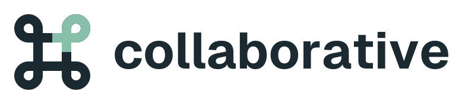
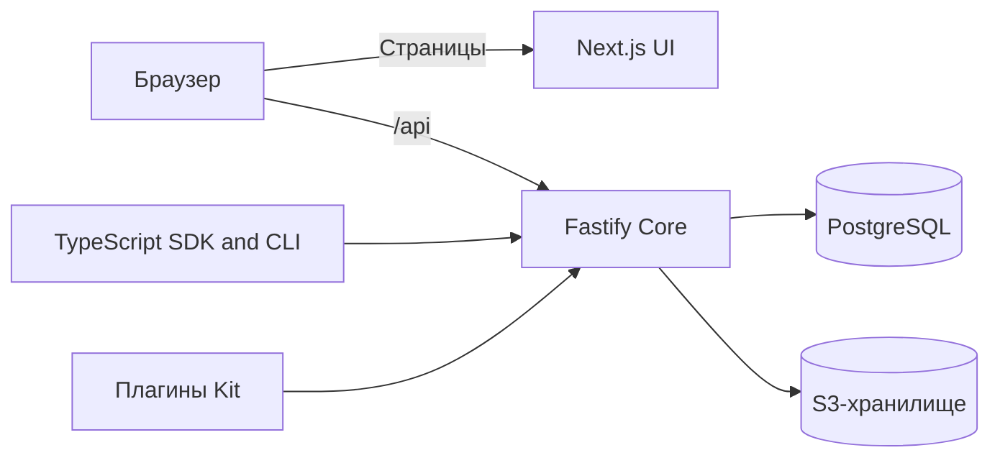

<!-- languages -->

[English](README.md) · [Русский](README.ru.md)

<!-- /languages -->

<p align="center">
  <picture>
    <source media="(prefers-color-scheme: dark)" srcset="docs/assets/brand/collaborative-logo-dark.svg">
    
  </picture>
</p>

<p align="center">
  <strong>Совместная работа с вашими данными PostgreSQL.</strong><br>
  Коллекции, админка, политики доступа и API — на вашей инфраструктуре.
</p>

[Быстрый старт](#быстрый-старт) · [Развёртывание](deploy/README.ru.md) · [Документация](docs/ru/index.md) · [Участие в проекте](CONTRIBUTING.ru.md)

Collaborative превращает данные PostgreSQL в рабочее пространство команды.
Создавайте коллекции и связи, настраивайте формы и таблицы, определяйте доступ
к строкам и полям. Работайте с теми же данными через HTTP API и типизированный
TypeScript-клиент, расширяйте продукт плагинами.

**Ранняя бета.** Отдельная установка рассчитана на одну команду. Интерфейс и
документация доступны на русском и английском; сайт документации по умолчанию
открывается на английском. SDK и CLI доступны в npm с тегом beta.

## Возможности

| Область              | Что доступно                                                                                                                         |
| -------------------- | ------------------------------------------------------------------------------------------------------------------------------------ |
| Модель данных        | Типизированные поля, M:1 / 1:M / M:N, дополнительные поля поддержанных системных коллекций, materialized views только для чтения     |
| Рабочее пространство | Формы и таблицы, релевантный поиск, вложенные фильтры, сохранённые виды, теги, переводы подписей коллекций и полей                   |
| Совместная работа    | Обсуждения, уведомления, присутствие, обновления сохранённых записей, временные блокировки полей, сохранение черновика при конфликте |
| Доступ               | Политики действий/полей/строк, приглашения по ссылке, пароли/passkey/SSO, сервисные аккаунты, OAuth/OIDC-приложения                  |
| Подключения          | S3, шифрование секретов, опциональный Yandex KMS, личные Google Drive/Sheets, опциональный Sentry                                    |
| Расширения           | Серверные обработчики, страницы UI, редакторы полей, коллекции и миграции через Kit; SDK и CLI генерации схемы                       |
| Ассистент            | Опциональный потоковый чат с историей, инструментами с правами пользователя и явно опубликованными действиями плагинов               |

Подробнее — [карта возможностей](docs/ru/guide/features.md). Workspaces группируют
коллекции, но не изолируют арендаторов. Плагины устанавливаются вместе с приложением;
серверный код выполняется как доверенный внутри Core.

## Совместная работа в реальном времени

Откройте запись в двух сессиях: видны участники, редактируемые поля и сохранённые
изменения. Таблицы и карточки получают события SSE. Несохранённые правки остаются
в форме; конфликт одного поля можно разобрать перед сохранением.

Блокировки помогают координации. Проверка конфликтов защищает сохранение черновика;
обычные API-запросы сохраняют свой контракт. События приходят от операций Core,
а не прямого SQL. [Как это работает](docs/ru/features/realtime.md).

## Быстрый старт

Для разработки нужны **Node.js 22+, pnpm 11.13.1 и Docker Compose**.

```sh
git clone https://github.com/Asmblyr/Collaborative.git
cd Collaborative
pnpm install --frozen-lockfile
pnpm db:up
cp -n apps/core/.env.example apps/core/.env
```

Задайте в apps/core/.env случайный ASMBLYR_SETUP_TOKEN длиной от 32 символов:

```sh
pnpm db:migrate
pnpm dev
```

Откройте [localhost:3000/setup](http://localhost:3000/setup), чтобы создать первого
администратора. Команда копирования выше рассчитана на POSIX; в Windows скопируйте
пример, не перезаписывая существующий .env.
[Подробный запуск](docs/ru/guide/getting-started.md).

## Docker и Kubernetes

Разворачивайте **Core и UI одной версии из одного коммита**. PostgreSQL и S3
подключаются отдельно. Оба компонента работают на одном публичном домене, API — /api.

- [Docker Compose](deploy/README.ru.md#docker-compose).
- [Helm-чарт](deploy/helm/collaborative) и [настройка Kubernetes](deploy/README.ru.md#kubernetes-и-helm).
- Образы: ghcr.io/asmblyr/collaborative-core и ghcr.io/asmblyr/collaborative-ui.
- [Обновления](docs/ru/guide/deployment.md), [копирование и восстановление](docs/ru/development/operations.md).

Закрепляйте оба образа одной версии по соответствующим digest. Сборка использует
SDK, Kit, Contracts и встроенные плагины из исходников; предварительная публикация
этих пакетов в npm не требуется.

## Подключение TypeScript-проекта

```sh
npm install @asmblyr-collaborative/sdk@beta
npm install --save-dev @asmblyr-collaborative/cli@beta
npx asm connect --url http://localhost:3000
```

CLI открывает вход и согласие в вашей установке, загружает доступную аккаунту схему
и генерирует типы коллекций/плагинов. Особый компилятор или плагин сборщика не нужен.
Разрешение на схему не даёт доступа к данным: рабочим запросам нужны отдельные
API-креды или сессия.

[SDK](docs/ru/reference/sdk-guide.md) · [CLI](docs/ru/reference/cli-guide.md) · [HTTP API](docs/ru/reference/http.md)

## Ассистент и плагины

Подключите OpenAI-совместимого провайдера. Ассистент работает с правами вызывающего
и коллекциями, явно открытыми его инструментам. Личные Google Drive/Sheets позволяют
читать по запросу и предлагать изменения для подтверждения пользователем.

Плагины публикуют выбранные действия через defineModelContext. Обычные HTTP-обработчики
не становятся инструментами автоматически. MCP используется внутри продукта;
публичного MCP endpoint пока нет.

[Архитектура ассистента](docs/ru/development/assistant-architecture.md) ·
[Первый плагин](docs/ru/development/first-extension.md) · [Kit](docs/ru/reference/kit-guide.md)

## Архитектура



Core отвечает за HTTP API, вход, права и базу. UI предоставляет админку.
PostgreSQL координирует события между экземплярами Core.
[Подробная архитектура](docs/ru/development/architecture.md).

## Участие в проекте

Ошибки и предложения — в [GitHub Issues](https://github.com/Asmblyr/Collaborative/issues).
Для кода создайте fork и pull request. Крупные изменения архитектуры/API сначала
обсудите в issue.

- [Как участвовать](CONTRIBUTING.ru.md), [локальная разработка](docs/ru/development/local-development.md).
- [Документация](docs/ru/index.md), [её сопровождение](docs/ru/development/documentation.md).
- [Безопасность и приватные сообщения](SECURITY.ru.md).

## Лицензия

[MIT](LICENSE). Зависимости сохраняют собственные лицензии. Опциональный локальный
MinIO распространяется под AGPL. Логотип использует Geist под
[SIL OFL 1.1](apps/ui/src/app/fonts/OFL.txt).
