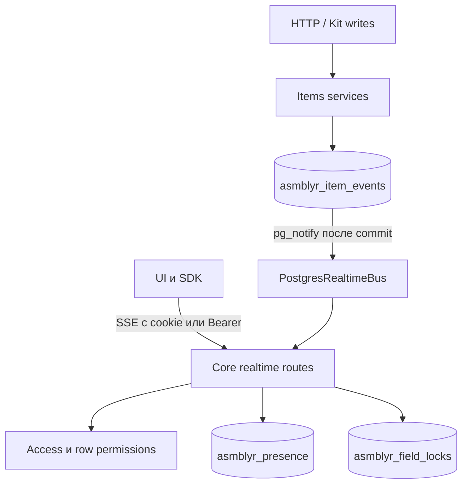

# Архитектура Collaborative Live

SSE выбран для односторонних уведомлений: браузер обращается к Core через `/api`,
а получение и освобождение locks остаётся обычным HTTP-запросом.
Отдельный WebSocket transport не требуется для этого обмена.

`recordItemEvent` записывает историю и публикует минимальный envelope внутри
той же транзакции. `LISTEN` использует отдельное соединение; переподключение
слушателя закрывает SSE-потоки, чтобы клиенты перечитали данные. В памяти Core
остаются только подписчики текущего процесса. `InMemoryRealtimeBus` служит для
изолированных тестов; PostgreSQL bus работает без дополнительного Redis.

Подписка ограничена одним scope (`page`, `collection`, `record`) и одним
clientId. Gateway повторно загружает права перед выдачей события. Коллекция
получает только invalidation, запись — metadata события после проверки строки.
Число соединений ограничено существующим лимитом 32 окон на сессию.
SSE heartbeat не обращается к БД; продление presence и прав выполняется раз в
20 секунд. Отставший сокет закрывается при переполнении буфера.

Field locks лежат в Core-owned таблице с составным ключом
`(collection_id, record_id, field)`. `INSERT ... ON CONFLICT ... WHERE`
атомарно разрешает обновление своему editor или перехват истёкшей lease.
Фоновая очистка удаляет просроченные блокировки и публикует `field.unlocked`.
Миграция только добавляет таблицу; откат удаляет временные leases, а не данные
пользователя.
