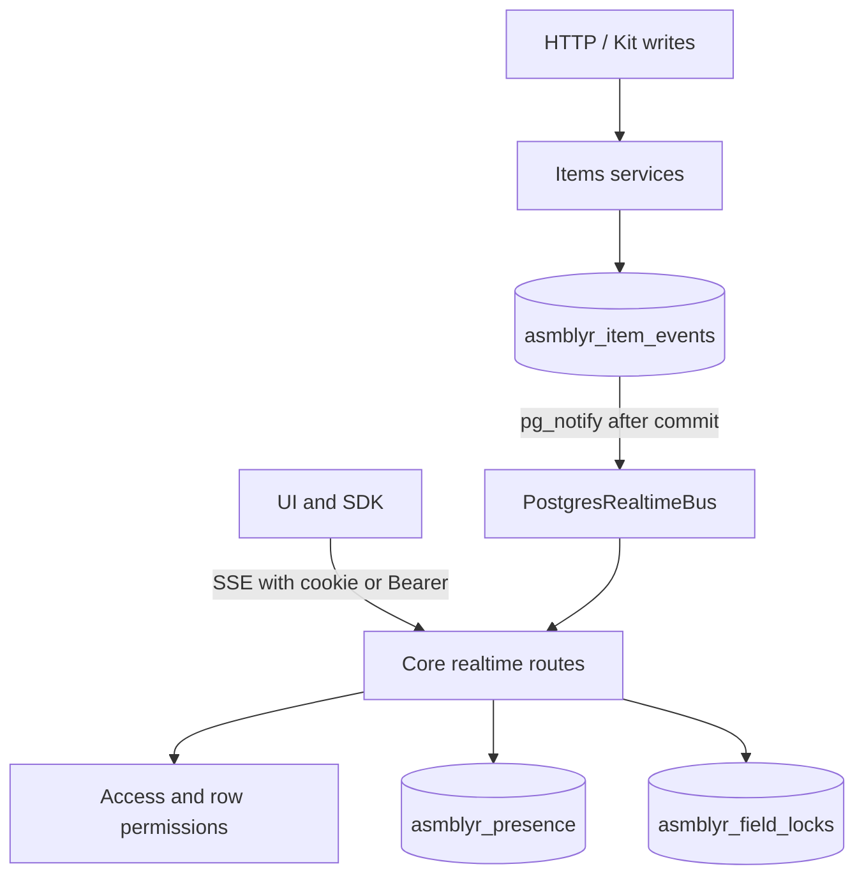

# Collaborative Live architecture

SSE carries one-way notifications: the browser reaches Core through `/api`, while
acquiring and releasing locks remains ordinary HTTP. This exchange does not
require a separate WebSocket transport.

`recordItemEvent` writes history and publishes a minimal envelope in the same
transaction. `LISTEN` uses a dedicated connection; reconnecting the listener
closes SSE streams so clients reload data. Core keeps only the current process's
subscribers in memory. `InMemoryRealtimeBus` supports isolated tests; the
PostgreSQL bus does not require Redis.

A subscription is limited to one scope (`page`, `collection`, `record`) and one
clientId. The gateway reloads permissions before delivering an event. Collections
receive only invalidation; records receive event metadata after the row check.
Connections use the existing limit of 32 windows per session. SSE heartbeats do
not query the database. Presence and permissions are renewed every 20 seconds,
sending the current participants to the client. A slow socket is closed if its
buffer fills. On Core shutdown, `preClose` closes active SSE streams before the HTTP server stops.

Field locks are stored in a Core-owned table with the composite key
`(collection_id, record_id, field)`. `INSERT ... ON CONFLICT ... WHERE` atomically
allows the owning editor to renew a lease or another editor to claim an expired
lease. Background cleanup removes expired locks and publishes `field.unlocked`.
The migration only adds a table; rollback removes temporary leases, not user data.
