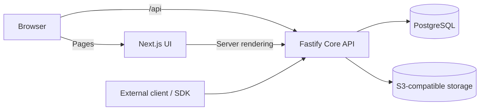
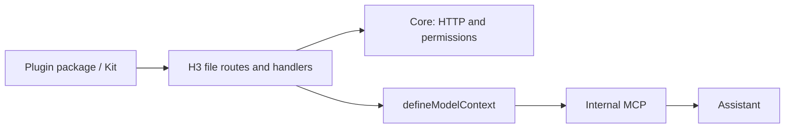

# Architecture

Collaborative consists of an HTTP API and an admin application. The primary
distribution uses separate Core and UI images; a compatible monolithic image is
also available. PostgreSQL stores schemas, records, and authentication state;
S3 stores file content.

The browser reaches Core directly through `/api`; Core owns browser sessions.
External clients access Core with their own access token. Files pass through
Core: PostgreSQL holds metadata and the configured object store holds content.

## Core and UI

`apps/core` uses Fastify and Knex. Routes parse requests, domain services enforce
permissions and behavior, and the query layer accesses PostgreSQL. `/collections`
manages schemas; `/items/:collection` manages data. System tables use the
`asmblyr_` prefix and change through versioned migrations.

`apps/ui` uses Next.js, React, and shadcn to render pages. The browser calls Core
through `/api`; Next has no API handlers. Core manages the HttpOnly browser
session, sign-in, and provider callbacks. During server rendering, Next reads
the cookie and calls Core as the current user.

Production runs separate Core/UI images and Deployments built from the same commit.
Ingress routes `/api`, `/sign/sso`, `/connections/google/callback`, and `/oauth`
to Core; the longer `/oauth/interaction` path and other pages go to UI. Consent
completes at Core's `/oauth/complete/:uid`; protocol cookies use `/oauth`.
A shared HTTPS origin preserves sessions and callbacks.

In local development, Compose, and the compatible monolithic target, Core's public
listener handles `/api` and forwards pages to Next. Monolithic ports are public
3000, Core 3001, and Next 3002. Helm disables that listener: ingress reaches each
component directly. Migrations run as a separate Job. The operator supplies PostgreSQL and S3.

Shared sessions, sign-in limits, assistant cancellation requests, and prepared
plugin forms live in PostgreSQL. An active generation controller stays in its
process; restarting interrupts the stream. Custom plugins must account for multiple replicas.

## Contracts and plugins

`packages/contracts` holds shared types. `packages/sdk` provides the HTTP client,
`packages/cli` connects projects and generates types, and `packages/kit` provides
plugin contexts, declarations, and the builder. Bundled discussions live in
`packages/plugin-comments`; Google tools in `packages/plugin-google-workspace`.
Tutorial examples are in `examples/plugins`. Installed packages are explicitly
listed in the root manifest's `asmblyr.plugins`.

Add `defineModelContext` only to the handlers you want to expose; other routes
remain HTTP-only. The assistant and internal MCP use the same handler, while
Core still checks data access. See the [tutorial](./first-extension.md) and
[assistant architecture](./assistant-architecture.md).

Server handlers use H3 file routing. UI imports a separate browser entry.
Declared model handlers share checks across HTTP, the assistant, and internal MCP.
Plugin tables use `plugin_<namespace>_` and their own migrations. See
[Kit](../reference/kit-guide.md) and [plugin actions](./plugin-actions.md).

## Access and storage

Core enforces action, field, row, and settings permissions. UI metadata is not
an access boundary. History and transactional hooks use the shared writer;
direct SQL and external effects do not automatically receive those guarantees.

File metadata lives in PostgreSQL and content in a private S3 bucket.
Workspaces group visible collections but do not isolate companies.
Arbitrary plugins run as trusted code; there is no sandbox.

See [CONTRIBUTING.md](https://github.com/Asmblyr/Collaborative/blob/main/CONTRIBUTING.md)
for change guidelines.
