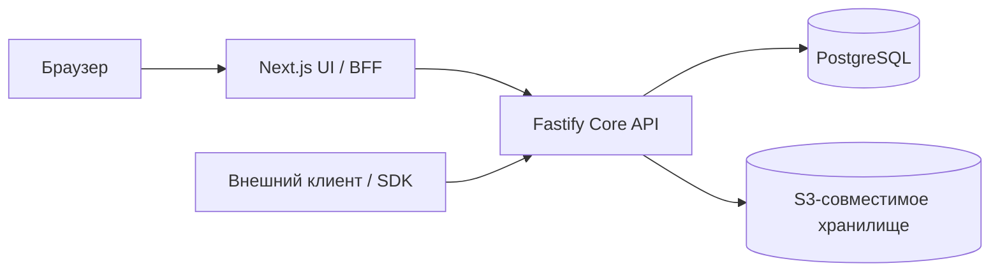
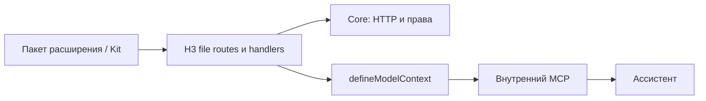

# Архитектура

Asmblyr состоит из HTTP API и приложения админки. Основной Docker-образ запускает
их в одном контейнере; код и ответственность компонентов остаются раздельными.
PostgreSQL хранит структуру, данные и состояние авторизации; S3 хранит содержимое
файлов.

Браузер обращается к Core через серверный прокси UI, который ведёт сессию.
Внешний клиент обращается к Core напрямую с собственным access token.
Файлы проходят через Core: метаданные находятся в PostgreSQL, содержимое —
в настроенном объектном хранилище.

## Core и UI

`apps/core` использует Fastify и Knex. Маршруты разбирают запрос, доменные сервисы
проверяют права и поведение, слой запросов работает с PostgreSQL. `/collections`
управляет структурой, `/items/:collection` — данными. Системные таблицы имеют префикс
`asmblyr_`; структура меняется версионными миграциями.

`apps/ui` использует Next.js, React и shadcn. Серверный BFF проксирует запросы
в Core и хранит данные сессии в HttpOnly cookies. Страницы используют общие
компоненты админки и предметные редакторы.

## Контракты и расширения

`packages/contracts` содержит общие типы. `packages/sdk` предоставляет HTTP-клиент,
`packages/cli` подключает SDK и генерирует типы, `packages/kit` содержит контексты,
декларации и сборщик расширений. Встроенные комментарии находятся в
`packages/plugin-comments`; инструменты Google — в `packages/plugin-google-workspace`.
Учебные примеры — в `examples/plugins`.
Установленные пакеты включаются явно в `asmblyr.plugins` корневого manifest.

`defineModelContext` добавляется только к нужному handler: остальные маршруты
остаются HTTP-only. Ассистент и внутренний MCP используют тот же обработчик;
доступ к данным всё равно проверяет Core. [Пошаговый пример](./first-extension.md)
и [архитектура ассистента](./assistant-architecture.md) раскрывают этот путь.

Серверные обработчики расширений используют H3 file routing. UI импортирует
отдельный браузерный entry. Объявленные model handlers используются HTTP,
ассистентом и внутренним MCP с общими проверками. Таблицы расширений имеют префикс
`plugin_<namespace>_` и собственные миграции. Подробности — в
[Kit](../reference/kit-guide.md) и [контракте действий](./plugin-actions.md).

## Доступ и хранение

Права проверяет Core: действия, поля, условия строк и grants настроек. UI metadata
не является границей доступа. История и транзакционные hooks проходят через общий
writer; прямой SQL и внешние эффекты не получают эти гарантии автоматически.

Файлы имеют метаданные в PostgreSQL и содержимое в приватном S3 bucket.
Workspace группирует видимые коллекции, но не изолирует компании.
Произвольные плагины исполняются как доверенный код; песочницы нет.

Рекомендации по изменениям — в
[CONTRIBUTING.md](https://github.com/Asmblyr/Collaborative/blob/main/CONTRIBUTING.md).
