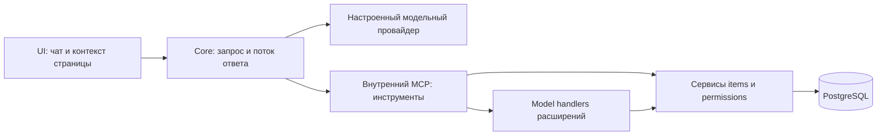

# Архитектура ассистента и model context

Ассистент — опциональная функция Core. Ключ и маршрут OpenAI-совместимого
провайдера остаются на сервере; UI передаёт текущую страницу и показывает потоковый
ответ. Поведение и лимиты описаны на [странице функции](../features/assistant.md).

## Инструменты и данные

Встроенные инструменты исследуют разрешённую схему, читают/ищут записи и готовят
фильтры и формы. Часть контекста поступает из display metadata и системного
справочника терминов. Технические имена остаются контрактом API; словарь терминов
помогает сопоставить выражения пользователя с данными, но не меняет права.
Точные сценарии и ограничения перечислены в [функциональном описании](../features/assistant.md).

Чат требует человеческого пользователя: superuser, хотя бы один data grant
read/create/update либо активное личное Google-подключение.
Каждый вызов инструмента проходит серверную проверку. `items` применяет права
действий, полей и строк; при MCP-вызове учитывается также `mcp.enabled` у каждой
затронутой коллекции, включая связанные пути и superuser. Публичного внешнего MCP
endpoint сейчас нет. Данные, возвращённые инструментом, могут попасть к
настроенному модельному провайдеру.

## Действия расширений

`server/api/**/*.post.ts` — обычный H3 HTTP handler. Разработчик явно оборачивает
подходящий обработчик в `defineModelContext<Input>(defineHandler(...), annotation)`.
`defineModelAnnotation` задаёт название, описание, `AccessGate`, при необходимости
`page` и `readOnly`. Сборщик Kit выводит runtime-схемы входа и выхода из типов
TypeScript. Один обработчик и его middleware вызываются по HTTP, из ассистента
и внутреннего MCP; ручного реестра в `plugin.ts` нет.

`AccessGate.authenticated` допускает запрос, но не выдаёт доступ к коллекциям.
`useItems(event)` использует права вызывающего. Для `readOnly: true` запись через
items блокируется. Привилегированное `storage.own` model handler не получает.
Подробный контракт, валидация и ограничения — в
[действиях расширений](./plugin-actions.md); рабочий пример —
[calculator](https://github.com/Asmblyr/Collaborative/tree/main/examples/plugins/calculator).
