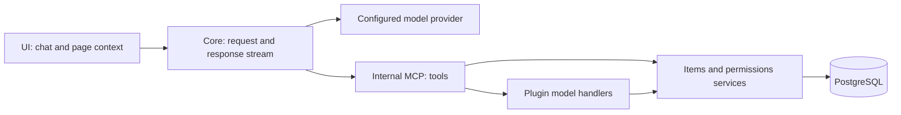

# Assistant architecture and model context

The assistant is optional Core functionality. The OpenAI-compatible provider's
key and endpoint stay on the server; UI supplies the current page and displays
the streamed response. Behavior and limits are in the [feature guide](../features/assistant.md).

## Tools and data

Built-in tools inspect permitted schemas, read/search records, and prepare filters
and forms. Display metadata and the system terminology dictionary supply part of
the context. Technical names remain the API contract; terminology helps match
user expressions to data without changing permissions. Supported scenarios and
limits are listed in the [feature guide](../features/assistant.md).

Chat requires a human user who is a superuser, has at least one read/create/update
data grant, or has an active personal Google connection. Every tool call undergoes
server checks. `items` enforces action, field, and row permissions. MCP calls also
respect `mcp.enabled` on every affected collection, including related paths and
superuser requests. There is no external public MCP endpoint. Data returned by
tools may be sent to the configured model provider.

## Plugin actions

`server/api/**/*.post.ts` is an ordinary H3 HTTP handler. Developers explicitly
wrap suitable handlers in `defineModelContext<Input>(defineHandler(...), annotation)`.
`defineModelAnnotation` supplies a title, description, `AccessGate`, and optional
`page` and `readOnly`. The Kit builder derives input/output runtime schemas from
TypeScript types. HTTP, the assistant, and internal MCP call the same handler and
middleware; there is no manual registry in `plugin.ts`.

`AccessGate.authenticated` admits a request but does not grant collection access.
`useItems(event)` uses the caller's permissions. `readOnly: true` blocks writes
through items. Model handlers do not receive privileged `storage.own`.
See [plugin actions](./plugin-actions.md) for validation and limitations, and
[calculator](https://github.com/Asmblyr/Collaborative/tree/main/examples/plugins/calculator)
for a working example.
